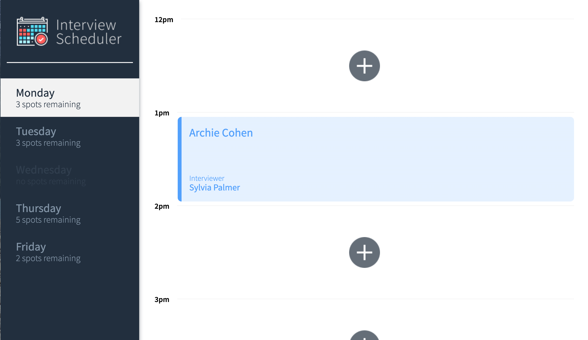
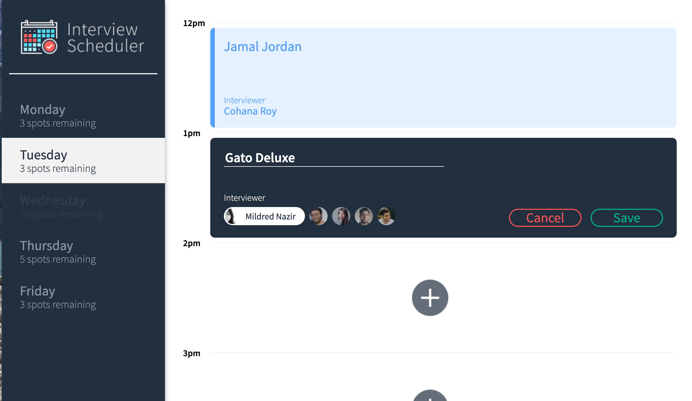
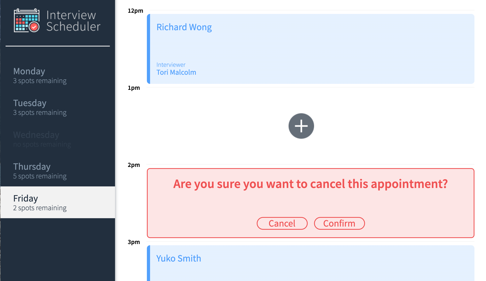

# Interview Scheduler

Interview scheduler is a project that allows users to choose a day, a time, and an interviewer in order to book in appointment. Appointments can me easily edited and updated, or cancelled through the app by clicking the icons in the bottom left hand corner of a booked interview timeslot. 

## Setup

Install dependencies with `npm install`.

## Running Webpack Development Server

```sh
npm start
```

## Running Jest Test Framework

```sh
npm test
```

## Running Storybook Visual Testbed

```sh
npm run storybook
```
## Screenshots of Project



